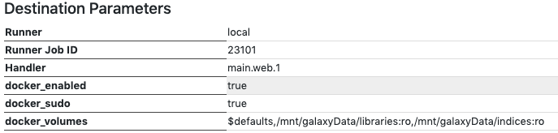

# Readme

This is a short docmunetation on the steps to take to use the workflow in Galaxy.

The content is briefly divided in:

- Configure your galaxy instance to use containers
- Copy the tool files
- Configure the remainig tools to use a container
- Run the workflow

As a convention in this document the Galaxy installation directory is called `$GALAXY_ROOT`.

During the manual installation of th etools you will be required ot restart Galaxy, be prepared for it.

## 1. Configure your Galaxy instance

The Galaxy version used during the development of this workflow is 19.01, if you are planning to use a more recente version of Galaxy you should compare the docs for possible changes of configuratons and best practices.
As container manager/runtimes the choice fell on Docker, if you plan to use another one you need to check for difference in configurations etc. yourself.

From the [official docs](https://docs.galaxyproject.org/en/release_19.01/admin/special_topics/mulled_containers.html):

>Since 2014 Galaxy supports running tools in Docker containers via a special container annotation inside of the requirement field.

An example is provided [here](https://github.com/galaxyproject/galaxy/blob/dev/test/functional/tools/catDocker.xml#L4).

But that is not all, you also need to install docker and make it executable by Galaxy.
The Docker installation is system specific and I advise to serch either the package mamager of your distro or the official docker [documentation/website](https://docs.docker.com/install/) for information on how to install Docker.

Once the Docker daemon is up and running, you need to make Galaxy be able to run docker commands. There are many recipies on the Internet with vaious degree of compromise between security and ease of use.
The Galaxy instance in use for this project runs in a Virtual Machine in a trusted environment not directly exposed to the internet and was runnind under an unpriviledge user, so the easy solution was to add to the sudoers file these two lines:

```config
# allow the galaxy user to run docker without password
galaxy  ALL = (root) NOPASSWD: SETENV: /usr/bin/docker
```

Assuming your Galaxy instance is running as normal unpriviledge user named `galaxy` this should allow it to run `docker` commands without a password, but it still need to *sudo* the command.

Nesxt step is to configure the job runner to use `docker`, the configuration file to do so is  `$GALAXY_ROOT/config/job_conf.xml`. An example configurations is:

```xml
<?xml version="1.0"?>
<job_conf>
    <plugins>
        <plugin id="local" type="runner" load="galaxy.jobs.runners.local:LocalJobRunner" workers="4"/>
    </plugins>
    <destinations default="docker_local">
        <destination id="local" runner="local"/>s
        <destination id="docker_local" runner="local">
                <param id="docker_enabled">true</param>
                <param id="docker_sudo">true</param>
                <param id="docker_volumes">$defaults,/mnt/galaxyData/libraries:ro,/mnt/galaxyData/indices:ro,/cvmfs/data.galaxyproject.org:ro</param>
        </destination>
    </destinations>
</job_conf>
```

This configuration allows Galaxy to run Docker with *sudo* and to mount a list of volumes in each container that Galaxy will run. If you have data in different directories feel free to add them here.
The *:ro* after each directory means *read only*, so the data in the mounted directories will not be modified.

## 2. Copy the tool files

As mentioned before the workflow is a proof-of-concept, so right now is not entirely avilabe from the official Galaxy tool sheds (also because of licensing issue of GATK v3).
Under the tools directory you can find the tools not distributed through official channels and that need to be installed by hand.

The procedure is documented [here](https://galaxyproject.org/admin/tools/add-tool-tutorial/).
It is advisable to keep the manually installed toosl separated from the oters and to create a tool panel section in Galaxy. To do this you need to create a new directory under `$GALAXY_ROOT/config/tools/` e.g. `$GALAXY_ROOT/config/tools/Wetlab2Variations`.
Copy there the xml files you can find under the `galaxy/tools` directory of this repo.
Modify your `$GALAXY_ROOT/config/tools_config.xml` file to make Galaxy aware of the new tools by adding a section element containig a tool element for each new tool, e.g.

```xml
 <section id="wetlab2variations" name="Wetlab2Variations">
    <tool file="Wetlab2Variations/picard-CreateSequenceDictionary.xml" />
    <tool file="Wetlab2Variations/picard-MarkDuplicates.xml" />
    <tool file="Wetlab2Variations/gatk-IndelRealigner.xml" />
    <tool file="Wetlab2Variations/gatk-BaseRecalibrator.xml" />
    <tool file="Wetlab2Variations/gatk-PrintReads.xml" />
    <tool file="Wetlab2Variations/gatk-HaplotypeCaller.xml" />
    <tool file="Wetlab2Variations/gatk-RealignerTargetCreator.xml" />
</section>
```

Once everyting is done you need to restart Galaxy to make the changes actual and the tools available.

## 3. Configure the remainig tools to use a container

The rest of the tools composing the workflow are available from the official tool shed.
Assuming you actually installed them through the official toolshed you can find the tools files under `$GALAXY_ROOT/database/shed_tools/toolshed.g2.bx.psu.edu/repos/` once there you need to find out under which repository name they are, e.g. *devteam* or *iuc* or another one, and which commit hash.

Let's take as an example an installation of BWA, its tool files can be found under `$GALAXY_ROOT/database/shed_tools/toolshed.g2.bx.psu.edu/repos/devteam/bwa/8d2a528a9513/bwa`
e.g.:

```console
galaxy@host:~$ ls -l $GALAXY_ROOT/database/shed_tools/toolshed.g2.bx.psu.edu/repos/devteam/bwa/8d2a528a9513/bwa
total 80
-rw-r--r-- 1 galaxy galaxy   100 May 31 08:52 README.rst
-rw-r--r-- 1 galaxy galaxy 21982 May 31 08:52 bwa-mem.xml
-rw-r--r-- 1 galaxy galaxy 19159 May 31 08:52 bwa.xml
-rw-r--r-- 1 galaxy galaxy 10265 Jun  5 10:35 bwa_macros.xml
-rw-r--r-- 1 galaxy galaxy 11275 May 31 08:52 read_group_macros.xml
drwxr-xr-x 2 galaxy galaxy  4096 May 31 08:52 test-data
drwxr-xr-x 2 galaxy galaxy    37 May 31 08:52 tool-data
-rw-r--r-- 1 galaxy galaxy   446 May 31 08:52 tool_data_table_conf.xml.sample
```

For a primer on how to read the tools file you can go [here](https://docs.galaxyproject.org/en/release_19.01/dev/schema.html), [here](https://galaxy-iuc-standards.readthedocs.io/en/latest/best_practices/tool_xml.html#tools), and [here](https://planemo.readthedocs.io/en/stable/writing.html#building-galaxy-tools).

The *requirements* xml element is where the the tool(s) and version(s) are specified, it is also where the use of a container for the tool is specified, so that is the place to configure our tools to make them use containers.
Some tools have the *requirements* element defined in a *macro*.
To stick with the BWA exmaple we then need to edit the `bwa_macros.xml` file and look for the *requiremnts macro*.

Look for an *xml* elemnt with a `name="requirements"` attribute, once found we need to add the requirememnt to use the BioContainer image of the tools. Tools plural because in the case of BWA there are two tools, BWA for the alignment and Samtools to sort the SAM output and convert it to BAM.

So in the end the requirement macro element shooul look similar to this:

```xml
<xml name="requirements">
    <requireents>
        <requirement type="package" version="@VERSION@">bwa</requirement>
        <requirement type="package" version="1.6">samtools</requirement>
            <container type="docker">quay.io/biocontainers/mulled-v2-fe8faa35dbf6dc65a0f7f5d4ea12e31a79f73e40:23592e4ad15ca2acfca18facab87a1ce22c49da1-0</container>
    </requirements>
</xml>
```

The tools inside the `quay.io/biocontainers/mulled-v2-fe8faa35dbf6dc65a0f7f5d4ea12e31a79f73e40:23592e4ad15ca2acfca18facab87a1ce22c49da1-0` container are bwa v0.7.17-r1188 and samtools v1.8.

For more information on multi-tool containers you can have look at the [BioContainers docs](http://biocontainers-edu.biocontainers.pro/en/latest/) and at the [Multi-package Containers page](https://biocontainers.pro/#/multipackage).

The same procedure needs to be done for Cutadapt.
In our installation the tool files were in `$GALAXY_ROOT/database/shed_tools/toolshed.g2.bx.psu.edu/repos/lparsons/cutadapt/e4691e1589d3/cutadapt`

```console
$ ls -l
total 76
-rw-r--r-- 1 galaxy galaxy 39237 Aug 29 12:54 cutadapt.xml
-rw-r--r-- 1 galaxy galaxy 20707 May 24 13:05 macros.xml
drwxr-xr-x 3 galaxy galaxy    19 May 24 13:05 static
drwxr-xr-x 2 galaxy galaxy  4096 May 24 13:05 test-data
drwxr-xr-x 2 galaxy galaxy    32 May 24 13:05 tool-data
-rw-r--r-- 1 galaxy galaxy   227 May 24 13:05 tool_data_table_conf.xml.sample
-rw-r--r-- 1 galaxy galaxy   175 May 24 13:05 tool_data_table_conf.xml.test
```

Inside `cutadapt.xml` find again the *requiremetn* element and add a *container* element like this one: `<container type="docker">quay.io/biocontainers/cutadapt:1.16--py27_2</container>`.
The resutl should be like the following:

```xml
    <requirements>
        <requirement type="package" version="1.16">cutadapt</requirement>
        <container type="docker">quay.io/biocontainers/cutadapt:1.16--py27_2</container>
    </requirements>
```

When all the configurations are done you should restart Galaxy.

# 3. Run the workflow

Once all the tools in the workflow are configured properly you can import the workfow file and run it.
Aleteratively you can pice it together by hand, the result shoulb be simila to the Figure below.


Since the workflow is a proof-of-concept, as stated before in the document, there are some caveats to take into account when runnin the workflow.
The workflow has been succefully tested only with the reference genome from history and not cached in Galaxy.
If you want to try ot run the workflow with a reference genome already in Galaxy you can, but you mgith run into troubles.
If, on the other hand, you want to run the workflow by provinding all the input data from history there a re a few assumptions that need to hold:

1. the reference genome, *.fasta* file, comes with an index, *.fai* file.
2. the refernece genome comes with a Picard *dictionary*.

The first requirement is probably already satisfied, most reference genomes that are downloadable come with a precalculated *.fai* index.

The second requirement is also pretty easy to satisfy, you can run Picard locally and upload the *dictionary* or alternatively you can run the tool prepared in this repo to create it in Galaxy and pass it to the requiring tools, basically GATK.

When the workflow is running you can veryfy that the tools are running in a container by checking the job details and if you can by runnig `docker ps`.

The tool job detail should show somethis similar to this:



Anf in `docker ps` something like this:

```console
$ docker ps
CONTAINER ID        IMAGE                        COMMAND                  CREATED             STATUS              PORTS               NAMES
037911d2d57a        broadinstitute/gatk3:3.6-0   "/home/galaxy/galaxy…"   9 days ago          Up 9 days                               frosty_gates
```

## Final notes

You might have seen that GATK is not configured to use a Docker contianer from BioContainers.
This is due, as mentioned before, to licensing issues in GATK version 3 that are resolved in GATK 4.
